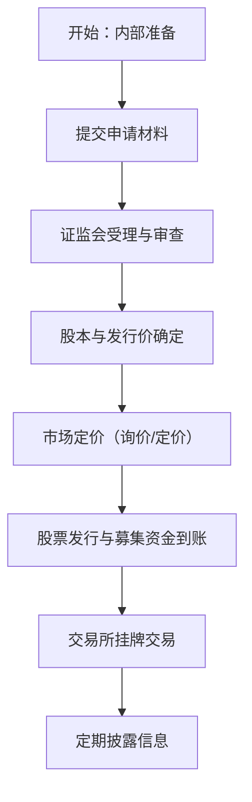

企业上市是公司[首次向公众发行股票](dictionary.md#IPO)并在交易所挂牌交易的过程。

# 上市流程

## 上市准备

根据《首次公开发行股票并上市管理办法》，公司须符合公司法与证券法规定的组织治理、财务披露等条件，并依法披露真实、准确、完整信息。[^1]

## 发行与股本确定

企业拟上市前确定[发行总股本](dictionary.md#gubenzonge)（原股东持股 + 新发行股份），并满足交易所关于公众持股比例及最低股本要求（如北交所规定上市后股本总额与公众持股比例要求）。[^2]
## 定价与询价机制

首次公开发行股票的[发行价格](dictionary.md#faxingjiage)可采用直接定价、初步询价后定价或累积投标询价等市场化定价方式，由发行人与主承销商结合询价结果确定最终发行价。[^1]

## 审批与注册

企业向中国证监会提出注册申请，保荐机构和承销商配合完成尽职调查及招股说明书编制。证监会对申请材料合规性进行审查，并决定是否受理与核准。[^1]
## 上市与交易

经核准后，按发行计划完成股票配售与募集资金到账，股票在交易所挂牌交易，成为公开市场可交易的证券。

## 信息披露

企业上市后需要按照监管要求定期披露企业经营相关的信息。[^3]

整体流程如下

[^1]: [首次公开发行股票并上市管理办法](https://www.csrc.gov.cn/csrc/c106256/c1653753/content.shtml?utm_source=chatgpt.com)

[^2]: [北京证券交易所上市公司证券发行注册管理办法](https://www.moj.gov.cn/pub/sfbgw/flfggz/flfggzbmgz/202306/t20230619_480981.html?utm_source=chatgpt.com)

[^3]: [上市公司信息披露管理办法](https://www.gov.cn/gongbao/2025/issue_12026/202505/content_7022576.html?utm_source=chatgpt.com)
