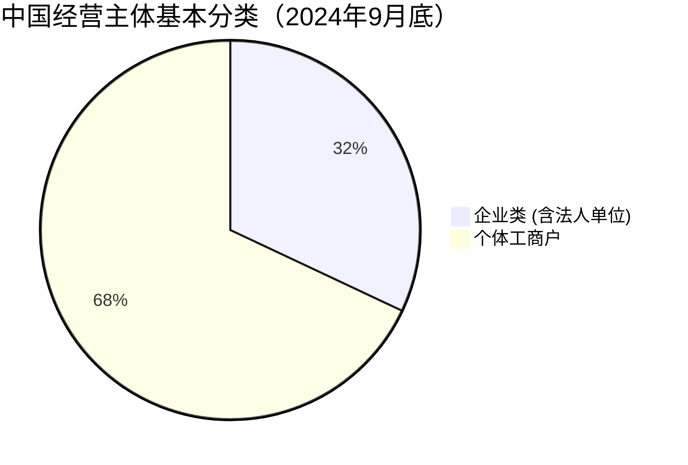
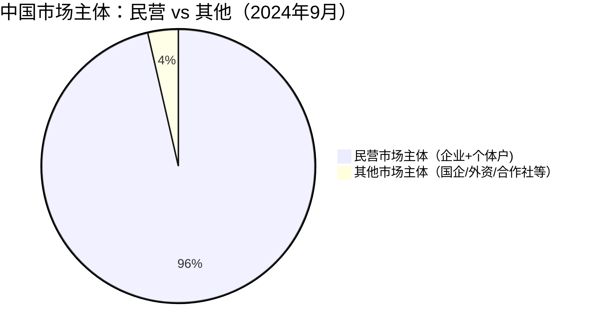

中国市场主体常见类型包括：**有限责任公司**（股东以认缴出资额对公司承担有限责任）、**股份有限公司**（资本由等额股份构成，可发行股票融资）、**合伙企业**（两个或多个合伙人共同经营，承担无限或有限责任）、**个人独资企业**（自然人投资、承担无限责任）以及**个体工商户**等，这些分类是按登记注册类型划分的基本企业组织形式。[^1]

# 数据统计

来自中国日报网[^2]

来自人民网[^3]

[^1]: [关于划分企业登记注册类型的规定](https://www.stats.gov.cn/xxgk/tjbz/gjtjbz/201310/t20131031_1758907.html)

[^2]: [截至今年9月底 全国登记在册经营主体达1.88亿户](https://china.chinadaily.com.cn/a/202411/08/WS672dc7b1a310b59111da26be.html?utm_source=chatgpt.com)

[^3]: [我国实有民营经济主体超1.8亿户（新数据 新看点）](https://cpc.people.com.cn/n1/2024/1110/c64387-40357770.html?utm_source=chatgpt.com)
