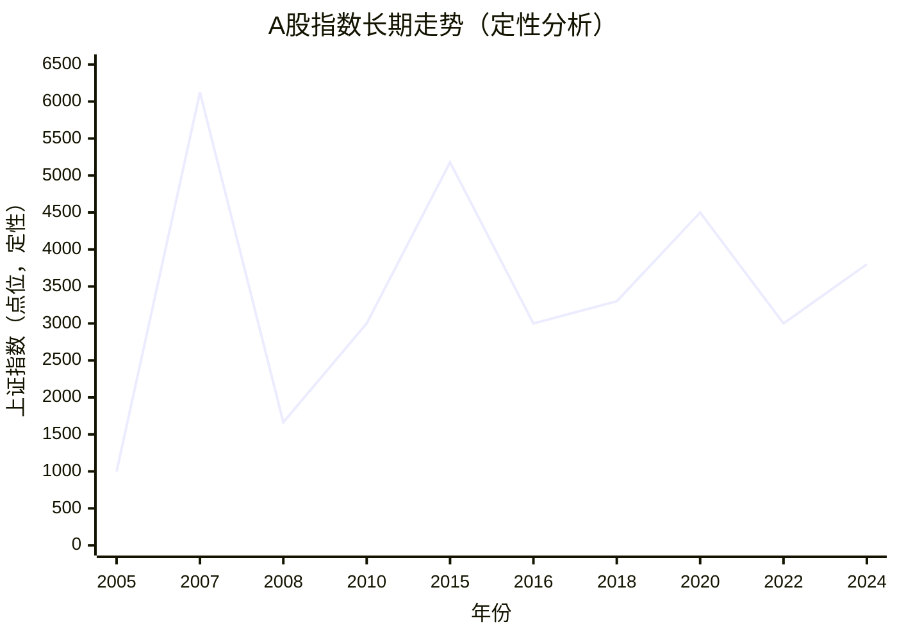

| 阶段             | 市场  | 表现                          | 特征                     | 原因                        |
| -------------- | --- | --------------------------- | ---------------------- | ------------------------- |
| 2005-2007年     | 牛市  | 上证指数从1000点左右涨至6124点         | 资金主要来自散户，市场情绪高涨，估值较高   | 经济高速增长、股改推进、人民币升值预期等      |
| 2008年          | 熊市  | 上证指数从2007年高点跌至1664点，跌幅超过70% | 市场情绪崩溃，资金外流，市场恐慌       | 全球金融危机、国内经济放缓、投资者信心崩溃     |
| 2009-2010年     | 反弹  | 上证指数从1664点反弹至3000点左右        | 短期内市场回升，部分板块表现强劲       | 政策刺激、经济复苏、货币宽松            |
| 2014-2015年     | 牛市  | 上证指数从2000点涨至5178点           | 市场暴涨，股市泡沫开始显现，短期资金涌入   | 政策宽松、资本市场改革、资金大量流入        |
| 2015年          | 熊市  | 上证指数在6月到8月大幅回落，出现“股灾”       | 市场剧烈波动，泡沫破裂，投资者恐慌抛售    | 股市泡沫破裂、过度投机、监管干预          |
| 2016-2018年     | 调整期 | 上证指数震荡在3000-3500点区间         | 市场震荡整理，情绪较为谨慎，估值逐渐回归合理 | 经济增速放缓，市场信心恢复较慢           |
| 2019-2021年     | 牛市  | 上证指数再次上涨，科技股表现强劲            | 科技股和消费类股表现亮眼，市场情绪较为乐观  | 政府刺激、全球货币宽松、科技创新推动        |
| 2020年          | 牛市  | 疫情后A股反弹，指数上涨至高点             | 疫情冲击后市场反弹，科技股强势，市场资金充裕 | 政策支持、疫情恢复、货币宽松、科技股崛起      |
| 2022-2023年     | 熊市  | 市场持续低迷，股指震荡下行               | 经济增速放缓，行业表现分化，投资者情绪低迷  | 国内外经济不确定性，房地产行业危机，疫情后复苏缓慢 |
| 2024-2025年（预测） | 复苏期 | 市场可能迎来新一轮的上涨                | 高新技术、绿色经济、消费升级等板块可能走强  | 政策支持、科技创新、绿色经济等因素推动       |

