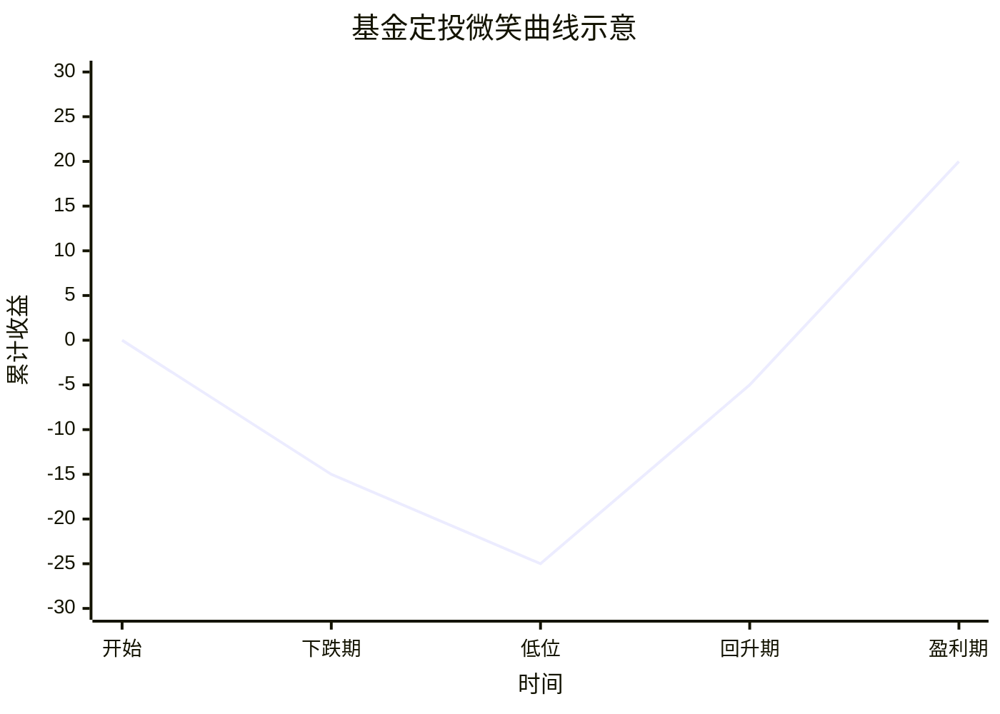

## 基金分类
基金可以按照购买方式分为场内基金和场外基金，场内基金需要通过证券账户操作（如 ETF[^1]、LOF[^2]）；场外基金不需要股票账户，平台更多（支付宝、微信、各银行），购买方式更加灵活。

按照基金投资的资产配置可以分为利息型基金（货币基金）、指数基金、债券基金、股票型基金、混合基金（便股型基金、偏债型基金）等，资产配置不同，风险收益不同。

按照基金的管理方式可以分为主动基金、被动基金（指数基金）。

按照基金所属的市场分为国内基金、QDII[^3]。
## 基金费用
基金管理组织需要对基金投资人收取各类费用，分为一次性费用和期限费用，一次性费用包括申购费、赎回费，期限费用包括托管费、管理费，管理费在不同类型的基金中差异较大，是基金组织的主要营收来源。

## 基金挑选

| 基金类型      | 挑选依据         | 挑选理由                                             | 适用人群       | 优点  | 缺点  |
| --------- | ------------ | ------------------------------------------------ | ---------- | --- | --- |
| 股票型基金     | 资金规模 股票构成 | 适中的规模更能平衡收益和风险 优秀的股票挑选能力决定了资金经理的水平            | 了解股票投资的投资者 |     |     |
| 指数型基金（场外） | 资金规模 指数类型 | 对于追踪大型指数（如上证指数、创业板指、深圳成指）等基金，更大的资金规模会带来更加客观的长期收益 | 长期主义的入门投资者 |     |     |
| ETF（场内）   | 同上           | 除了场外指数型基金所有拥有的优势外，还额外拥有交易费率低的优点                  | 优先选择       |     |     |
| QDII      |              | 对冲 A 股市场风险                                       |            |     |     |
## 投资哲学
保持理性，看不懂的不投资，风险无法承担的不投资
## 投资策略
### 定投
一种长期投资策略，将可用于投资基金的资金分散成多份，无论市场行情，分批定期购买，利用时间和市场波动降低平均投资成本，克服人性弱点，避免择时风险。在**理想的情况下**，定投的时间价格曲线呈现出“微笑”状：

### 投资组合
在分批定期的前提下，进一步分散投资的目标，分散风险

[^1]: ETF（Exchange Traded Fund 交易型开放式指数基金）

[^2]: LOF（Listed Open-Ended Fund 上市型开放式基金）

[^3]: QDII（Qualified Domestic Institutional Investor 合格境内机构投资者）
