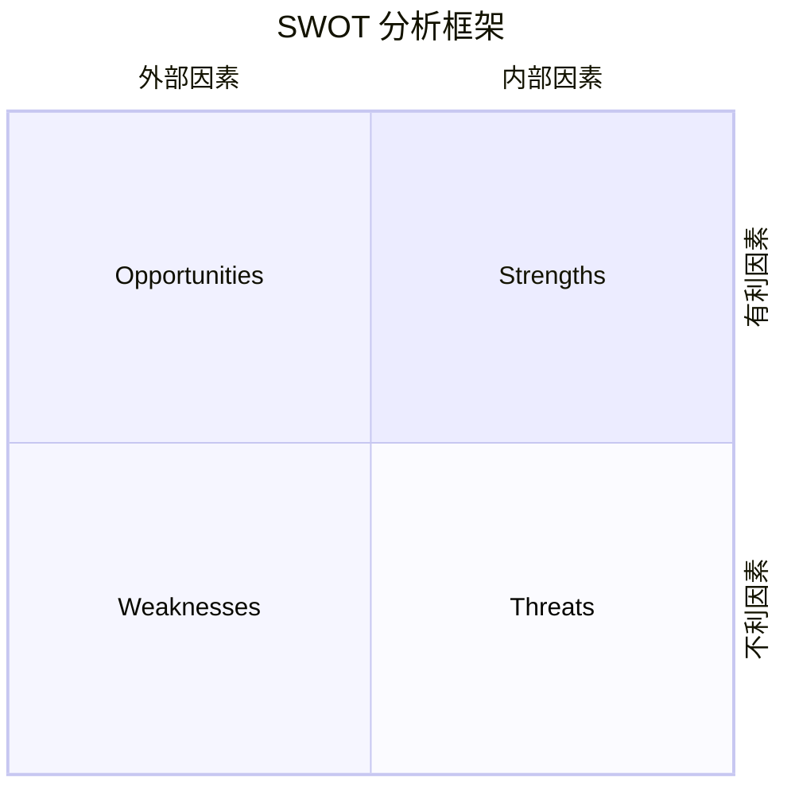

从不同的角度分析一件事情是否值得做

# PEST(Political Economic Social Technological)[^1]
分析外部宏观因素

- **P – Political（政治因素）**：政府政策、法律法规、贸易壁垒、税收政策、政治稳定性等。
- **E – Economic（经济因素）**：经济增长、利率、汇率、通胀、失业率、市场规模等。
- **S – Social（社会因素）**：人口结构、文化习惯、生活方式、社会价值观等。
- **T – Technological（技术因素）**：技术发展水平、创新速度、自动化、技术法规等。

## PESTLE
在 PEST 基础上引入了 LE

- **L – Legal（法律因素）**：法律法规、合规要求、监管制度、知识产权保护等。
- **E – Environmental（环境因素）**：环境政策、生态保护要求、气候变化、可持续发展标准等。

# 五力模型 (Porter's Five Forces)
分析个人或项目所处环境的竞争压力和战略机会

- **现有竞争者的竞争强度（Rivalry Among Existing Competitors）**：同行或同类型项目之间的竞争，例如职业领域中同岗位人才的数量和能力差异。  
- **潜在进入者的威胁（Threat of New Entrants）**：新进入者带来的竞争压力，例如新毕业生、跨行业人才或新兴项目加入。  
- **替代品的威胁（Threat of Substitutes）**：可替代方案对自身价值的影响，例如其他学习路径、工具或项目方法可能取代现有选择。  
- **供应商议价能力（Bargaining Power of Suppliers）**：资源或支持方对自身的影响，例如导师、平台或工具提供者对项目进展的影响力。  
- **客户议价能力（Bargaining Power of Buyers）**：目标受益者或输出对象对自身价值的影响，例如雇主、客户或合作伙伴对技能或成果的需求和要求。

# SWOT(Strengths Weaknesses Opportunities Threats)[^2]
分析个人或项目的内部与外部因素

- **S – Strengths（优势）**：个人或项目自身具备的积极特质或能力，例如专业技能、学习能力、经验积累、人脉资源等。  
- **W – Weaknesses（劣势）**：自身存在的不足或限制，例如时间管理能力弱、缺乏某项技能、资源有限、经验不足等。  
- **O – Opportunities（机会）**：外部环境中可利用的有利条件，例如行业发展趋势、新兴技术、职业发展机会、政策扶持等。  
- **T – Threats（威胁）**：外部环境中可能带来不利影响的因素，例如竞争压力、经济波动、技术快速更新导致技能过时、政策限制等。

# VRIO (Value, Rarity, Imitability, Organization)
分析个人或项目资源或能力的竞争优势潜力

- **V – Value（价值）**：资源或能力是否能帮助实现目标或创造收益，例如技能能否提升工作效率或成果质量。  
- **R – Rarity（稀缺性）**：资源或能力是否独特或不易获得，例如少数人掌握的专业技能或经验。  
- **I – Imitability（难以模仿性）**：资源或能力是否难以被他人复制，例如个人独特经验、创新方法或专有知识。  
- **O – Organization（组织化）**：是否能够有效利用资源或能力实现目标，例如是否有合适的方法、系统、时间管理或支持环境。

# CBA (Cost-Benefit Analysis)
分析个人或项目决策的成本与收益平衡

- **成本（Costs）**：为实现目标需要付出的资源，包括时间、金钱、精力、机会成本等。  
- **收益（Benefits）**：从决策中可获得的回报，包括经济收益、经验积累、技能提升、人脉扩展、生活质量改善等。  
- **核心思路**：将成本和收益量化或明确化，判断投入是否值得，以及如何优化决策以提升净收益。

# BMC (Business Model Canvas)
从整体结构梳理个人或项目的价值创造和运作模式

- **客户群体（Customer Segments）**：谁是受益者或目标对象，例如自己成长的方向、职业目标或服务的受众。  
- **价值主张（Value Propositions）**：提供的核心价值或解决的问题，例如技能提升、产品服务、个人影响力。  
- **渠道（Channels）**：价值传递方式，例如社交网络、学习平台、工作项目、沟通方式。  
- **客户关系（Customer Relationships）**：与受益对象的互动方式，例如反馈机制、合作方式、社群参与。  
- **收入来源（Revenue Streams）**：收获价值的途径，例如薪资、奖金、项目收益、知识付费。  
- **关键资源（Key Resources）**：实现价值需要的资源，例如时间、资金、技能、工具、信息。  
- **关键活动（Key Activities）**：创造价值必须进行的行动，例如学习、实践、交流、项目执行。  
- **关键伙伴（Key Partners）**：支持价值创造的合作对象，例如导师、团队成员、平台、同行。  
- **成本结构（Cost Structure）**：价值创造过程中的主要消耗，例如学习成本、生活成本、工具成本。

[^1]: [PEST分析模型](https://wiki.mbalib.com/wiki/PEST?utm_source=chatgpt.com)

[^2]: [SWOT analysis](https://en.wikipedia.org/wiki/SWOT_analysis?utm_source=chatgpt.com)
